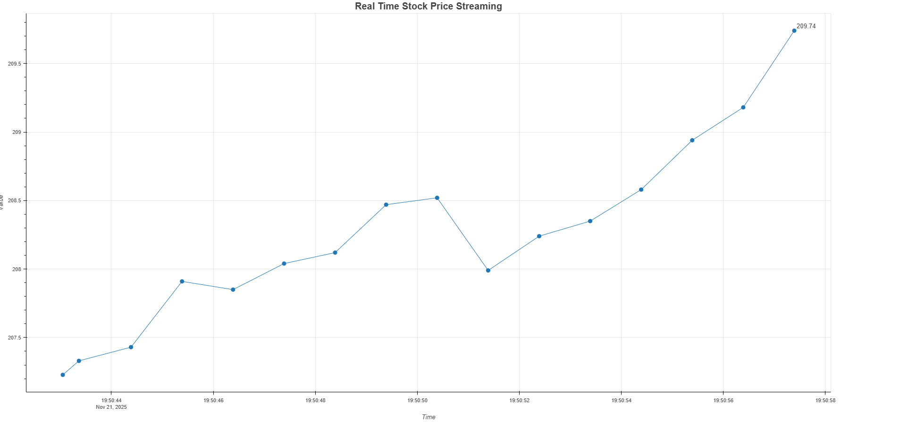
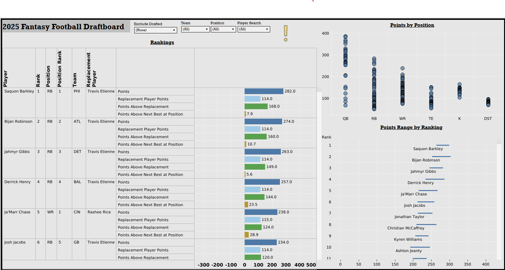
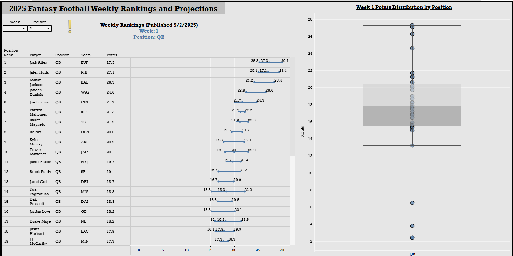
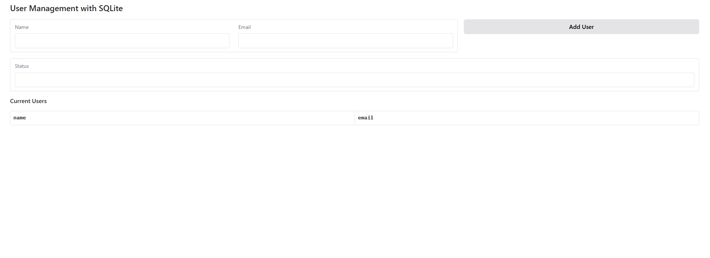

# Projects
## Machine Learning
### ML API
A FastAPI enpoint serving a sklearn pipeline with an ordinal logistic regression model to predict customer's "small quantity order importance ranking (1-10)." The pipeline constist of 3 steps:<br>
1. Column Transformer<br>
        a. Standard Scaling for numerical variables<br>
        b. One-hot-encoding for categorical variables
2. Feature Selection<br>
        a. Lasso Regression
3. Model <br>
        a. Mord Ordinal Logistic Regression

The fitted pipeline/model is then serialized with joblib, served with Uvicorn, containarized with Docker, and finally deployed to HuggingFace Spaces. 

Prediction requests can be sent to https://dkondic-ml-api.hf.space/predict as a list of dictionaries where each dictionary is an instance to predict. Thus prediction is possible for single instance or batch of instances.

Request Body
```
[
  {
    "CUST_NBR": "string",
    "MENU_TYP_DESC": "string",
    "PYR_SEG_CD": "string",
    "DIV_NBR": "string",
    "WKLY_ORDERS": 0,
    "PERC_EB": 0,
    "AVG_WKLY_SALES": 0,
    "AVG_WKLY_CASES": 0
  }
]
```
Resonse Body
```
{
  "prediction": [
    0
  ]
}
```

<br>
<br>
Please see <a href="https://dkondic-ml-api.hf.space/">API Docs</a> for more indormation.<br> 
<a href="https://github.com/Dacho688/ML_API">Source Code on GitHub</a>   

## Data Visualization
### Bokeh Web Applications
#### Real Time Data Streaming


A real time stock price streaming web application built with Python, Bokeh, Bokeh Server, and Docker. First, a Python bokeh interactive visualization is created along with it's data generation and callback functions. Data generation is simulated using random starting price and random price movements and runs in a separate thread continuously. Each second a new data point is generated and then passed back to the main thread as a stream appending the new value to the original data. The main thread then updates the visualization on the next tic callback. This is all encapsulated by a Python class with its own methods and attributes. Bokeh Server is then used to serve this Python application and acts as a bridge between the client/browser and the backend Python code. We then containarize the appliation using Docker making it portable, scalable, and deployable on any platform. 
<br>
<br>
<a href="RealTimeDataStreaming">Try App</a><br>
<a href="https://github.com/Dacho688/RealTimeDataStreaming">Source Code on GitHub</a>

    


### Tableau
#### Fantasy Football Draftboard

<br>
<br>
This is more than a draftboard, it is a fantasy football draft optimizer where player rankings are based on value above replacement player. We first obtain NFL statistical projections from multiple sources. We then calculate fantasy points and average it to obtain Player Projected Points. We then compare those projections to a replacement player's projected points. A replacement player is defined as the "worst" starter given the league's number of teams and positional requirements settings. For example, a 10 team league with 1 QB starter would mean that for QBs a replacement player would be the 10th highest Player Projected Points as mentioned above(1x10=10). Finally, we summarize these rankings by creating an interactive Tableau dashboard that can be used live on draft day to guide you in making data driven draft decisions.
<br><br>
Try it directly from this site my clicking Try Dashboard below!
<br><br>
NOTE: Projected Points are calculated based on Yahoo's custom point per reception and carry scoring. Future variations may include the ability to enter custom scoring settings.
<br><br>
<a href="FantasyFootballDraftboard">Try Dashboard</a><br>
<a href="https://public.tableau.com/app/profile/davor.kondic/vizzes">See my Tableau Public Profile</a><br>

#### Fantasy Football Weekly Rankings and Projections

<br>
<br>
A weekly fantasy football points projection dashboard. Continuing with the same strategy as in our Fantasy Football Draftboard dashboard, we first obtain NFL statistical projections from multiple sources. We then calculate fantasy points by source and average it to obtain Player Projected Points and thus player rankings. Finally, we summarize these findings by creating an interactive Tableau dashboard and updating data on a weekly basis (usually Wednesdays).
<br><br>
Try it directly from this site my clicking Try Dashboard below!
<br><br>
NOTE: Projected Points are calculated based on Yahoo's custom point per reception and carry scoring. Future variations may include the ability to enter custom scoring settings.
<br><br>
<a href="FantasyFootballWeeklyRankingsAndProjections">Try Dashboard</a><br>
<a href="https://public.tableau.com/app/profile/davor.kondic/vizzes">See my Tableau Public Profile</a><br>

## Web Apps
### Databases
#### User Management with SQLite

<br>
<br>
A "User Management" web app using SQLite. In this project we explore database creationg, management, and embedding. First create a simple 1 table database with name and email as columns. We then embedd the database into our Gradio web app and create Python functions with error handling to manage the user creation, query, and status. The app is then deployed to Huggingface spaces and made available as a URL link. Give it a try and create some users by clicking Try App below.
<br>
<br>
<a href="UsersDatabase">Try App</a><br>
<a href="https://github.com/Dacho688/UsersDatabase">Source Code on GitHub</a>

### AI Agents and Chatbots
#### Resume Chatbot

For your convenience and fun, I built a Resume AI so that you can chat with my resume directly. A Gradio web app deployed to HuggingFace Spaces powered by Meta-Llama-3.3-70B-Instruct large language model (LLM) and with careful system prompt engineering is able to answer to user's questions based only on my resume's content. It is a conversational AI so it will remember your conversation as you chat with it. 

<a href="ResumeChatbot">Try App</a><br>
<a href="https://github.com/Dacho688/ResumeChatbot">Source Code on GitHub</a>

    

#### Data Analyst AI Agent

A personal Data Analyst Agent built with Meta-Llama-3.3-70B-Instruct LLM and deployed as a Gradio web app to HuggingFace Spaces. Using the ReACT (Reasoning and Action) framework this AI agent thinks, acts, and observes sequentially until the final answer is reached. Using the transformers Python package and their ReactCodeAgent framework, this agent acts and observes with only a Python code interpreter tool. 

1. Upload data as .csv text file.
2. Ask a question or give it a task.
3. Hit RUN!
4. Watch it think and act using Python code and print outputs!
   
<a href="DataAnalyst">Try App</a><br>
<a href="https://github.com/Dacho688/Data_Analyst">Source Code on GitHub</a>

    

#### Image Chatbot
A conversational AI using the open source and SOTA Llava-Next large multimodal model (LMM). With advanced visual reasoning and conversational skills, this AI is capable of summarizing, question answering, and even holding a conversation on any image. Llava-Next is downloaded from Huggingface Hub, loaded to Cuda GPU, and deployed as a Gradio web app on Huggingface's ZeroGPU technology. 

<a href="ImageChatbot">Try App</a><br>
<a href="https://github.com/Dacho688/ImageChatbot">Source Code on GitHub</a>

   

